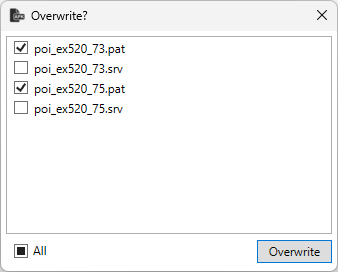

# Ts Unpack

## Overview

Ts Unpack is a replacement application for the original Train Simulator tool used to unpack `.apk` files. It includes the following improvements:

- You can choose the destination folder for unpacking.
- You can select which existing files to overwrite.
- It preserves the letter case of file names.

## Requirements

`.NET 8`

## Installation

Unpack `TsUnpack.zip`.

If you have Train Simulator installed, you can replace the original `tsunpack.exe` to automatically unpack activities by double-clicking on an `.apk` file.

### Registry bug

There is an error in the Windows registry from the original Train Simulator installation. To fix this, locate one of the following registry keys:

- `HKEY_LOCAL_MACHINE\SOFTWARE\Classes\TrainSim.Packaged.Activity\shell\open\command`
- `HKEY_CLASSES_ROOT\TrainSim.Packaged.Activity\shell\open\command`

Change the value from:

`"C:\Program Files (x86)\Microsoft Games\Train Simulator\Utils\TSUnpack.exe" " "`

to:

`"C:\Program Files (x86)\Microsoft Games\Train Simulator\Utils\TSUnpack.exe" "%1"`.

## Configuration

Running the application without arguments will start it in configuration mode. In this mode, you can set the path for unpacking activities:

- **Default path**: The path where Train Simulator is installed.
- **Custom path**: A user-defined path where you want to unpack activities.

The custom path has a higher priority than the default path.

## Usage

When you double-click an `.apk` file, the application unpacks it to the specified path. If there are any existing files in the destination directory, a window will open, allowing you to choose which files to overwrite.

After unpacking, the application will display a results window. This window lists all the files related to the activity, grouped by the operation performed:

- **Created**: Newly created files.
- **Skipped**: Files that were skipped because they already exist in the destination directory.
- **Overwritten**: Files that were overwritten in the destination directory.
- **Failed**: Files that encountered errors during unpacking.

## License

This project is licensed under the MIT License.
